# LifeBridge AI – Medical-Grade Multilingual Communication Platform

<div align="center">
  
  <!-- Badges -->
  <a href="https://aws.amazon.com/"></a>
  <a href="docs/COMPLIANCE.md"></a>
  <a href="https://react.dev"></a>
  <a href="backend/serverless.yml"></a>
  <a href="LICENSE"></a>

  <p><strong>Breaking language barriers in healthcare—securely, reliably, and at scale.</strong></p>
</div>

---

## Table of Contents
1. [About](#about)
2. [Features](#features)
3. [Architecture](#architecture)
4. [Tech Stack](#tech-stack)
5. [Getting Started](#getting-started)
6. [Deployment](#deployment)
7. [Compliance & Security](#compliance--security)
8. [Roadmap](#roadmap)
9. [Contributing](#contributing)
10. [License](#license)
11. [Medical Disclaimer](#medical-disclaimer)

---

## About
LifeBridge AI is a production-ready, multilingual communication platform designed for hospitals, clinics, and emergency responders. The system delivers near-instant, context-aware translations—including sign-language recognition—while meeting strict regulatory requirements such as HIPAA. Built on AWS Serverless technologies, LifeBridge AI scales automatically and remains cost-effective within the AWS Free Tier.

---

## Features
### Medical-Grade Translation
* Real-time speech-to-speech, speech-to-text, and text-to-text translations covering **more than half of the world**.
* **Sign-language detection** (static and dynamic gestures) for critical medical commands.
* **Context preservation** for medical terminology and abbreviations.

### Compliance & Auditability
* End-to-end encryption (TLS 1.3, AES-256 at rest via AWS KMS).
* Immutable audit trail stored in Amazon DynamoDB Streams + S3 Glacier for 7 years.
* Automated **PHI redaction** and configurable data-retention policies.

### Human-in-the-Loop Quality Assurance
* Integrated **review dashboard** for medical professionals.
* AI-assisted quality scoring, bias detection, and hallucination mitigation.
* <30-second escalation workflows for life-threatening scenarios.

### Offline & Edge Readiness
* Local phrase bank for **10 emergency scenarios** with zero connectivity.
* Progressive Web App (PWA) support and intelligent caching.
* Graceful degradation with on-device fallback models.

### Analytics & Impact Metrics
* Real-time KPIs: translation accuracy, response latency, cost savings.
* Exportable analytics (JSON/CSV) for hospital EHR and BI systems.

---

## Architecture

```mermaid
flowchart TB
  subgraph Frontend
    A[React PWA] --> B[Multi-Modal Interface]
    B --> C[Speech Recognition]
    B --> D[Sign-Language Detection]
  end

  subgraph Backend
    E[AWS API Gateway] --> F[AWS Lambda Functions]
    F --> G[Amazon Bedrock – Nova]
    F --> H[Audit Logger]
    F --> I[PHI Redactor]
    F --> J[Human Review Queue]
  end

  subgraph Data
    H --> K[DynamoDB + Streams]
    J --> L[SNS & SES Notifications]
    K --> M["S3 Glacier (7-Year Retention)"]
  end

  style A fill:#61DAFB,stroke:#333,stroke-width:1px
  style F fill:#FF9900,stroke:#333,stroke-width:1px
```

*For a detailed service-by-service breakdown, see* [`docs/SECURITY_OVERVIEW.md`](docs/SECURITY_OVERVIEW.md).

---

## Tech Stack
| Layer                | Technology                          |
|----------------------|--------------------------------------|
| Frontend             | React 19, TypeScript, Vite, PWA      |
| Backend              | AWS Lambda (Node.js 20.x)            |
| AI & ML              | Amazon Bedrock (Nova Micro)          |
| CI / CD              | GitHub Actions + AWS SAM CLI          |
| Data & Storage       | DynamoDB, S3, KMS, CloudWatch        |
| Testing              | Jest, Playwright, Cypress            |
| Infrastructure as Code | Serverless Framework (`serverless.yml`) |

---

## Getting Started
### Prerequisites
* **Node.js ≥ 20** and **npm ≥ 10**
* **AWS CLI** configured with a least-privilege IAM user
* Optional: **Serverless Framework** (`npm i -g serverless`)

### Local Development
```bash
# 1. Clone the repository
$ git clone https://github.com/<your-org>/lifebridge-ai.git && cd lifebridge-ai

# 2. Frontend
$ cd frontend && npm ci && npm run dev        # http://localhost:3000

# 3. Backend
$ cd ../backend && npm ci && npm run build
$ npx serverless offline start                 # Local API at http://localhost:4000

# 4. Tests (all packages)
$ cd ../tests && npm ci && npm test
```

---

## Deployment
| Environment | Command                                                   |
|-------------|-----------------------------------------------------------|
| **Dev**     | `npx serverless deploy --stage dev`                       |
| **Prod**    | `npx serverless deploy --stage prod` *(HIPAA Hardening)*  |

After deployment, run `scripts/deployment_verification.py` to perform post-deployment health checks.

> 💸 **Cost-Aware**: The default `dev` stack remains within AWS Free Tier limits.

---

## Compliance & Security
LifeBridge AI incorporates best practices outlined in the [AWS HIPAA Security & Compliance whitepaper](https://d1.awsstatic.com/whitepapers/compliance/AWS_HIPAA_Compliance_Whitepaper.pdf).

Key controls include:
* **Encryption**: TLS 1.3 in transit; AES-256 + KMS at rest.
* **Logging**: CloudWatch Logs with VPC Flow Logs for network visibility.
* **Access Control**: IAM least-privilege policies and scoped resource tags.
* **Incident Response**: Automated alerts through PagerDuty + AWS SNS.

---

## Roadmap
- [ ] **FHIR Integration** for direct EHR connectivity
- [ ] **Edge Deployment** on AWS IoT Greengrass for field hospitals
- [ ] **Multilingual Triage Bot** powered by Bedrock Chat API
- [ ] **ISO 27001 Certification** audit & gap analysis

---

## Contributing
We value the expertise of both healthcare professionals and software engineers.

1. **Fork** this repository.
2. Create a feature branch: `git checkout -b feat/<short-description>`.
3. Commit your code following [Conventional Commits](https://www.conventionalcommits.org/).
4. Run `npm run test` **&** `npm run lint` before pushing.
5. Open a PR and fill in the pull-request template.

---

## License
This project is licensed under the **MIT License** – see the [LICENSE](LICENSE) file for details.

---

## Medical Disclaimer
LifeBridge AI is **not** a certified medical interpretation service. While it enhances communication, final medical decisions should always be made by qualified healthcare professionals.

---

<div align="center">
  <strong>© 2025 LifeBridge AI • All rights reserved</strong>
</div> 