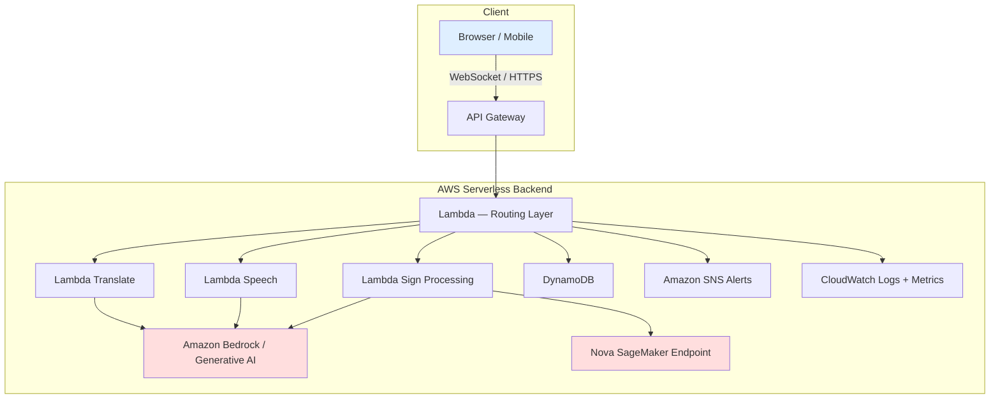
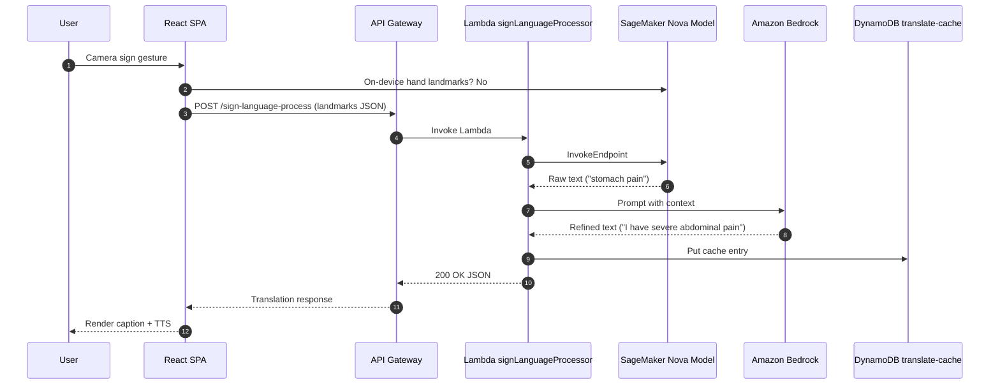
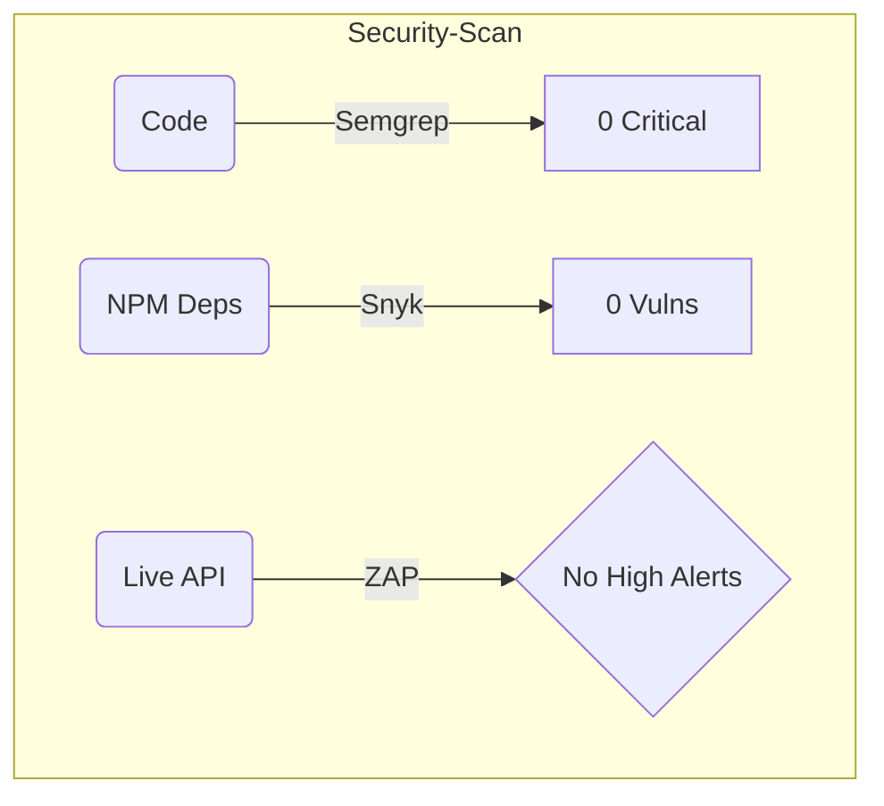
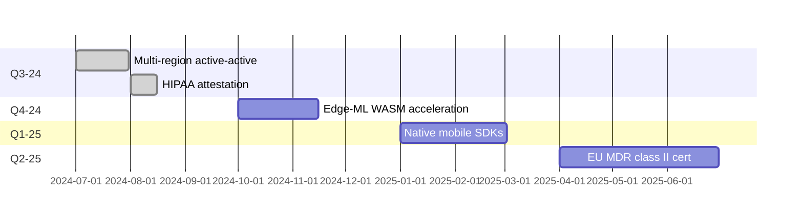

# LifeBridge Technical Documentation (v1.0.0)

> **Executive Summary**
> 
> LifeBridge is a real-time, multimodal communication platform that bridges speech, text and sign language—optimised for high-stakes medical and emergency scenarios. Built on an AWS-native, fully serverless stack and powered by Amazon Generative AI services, LifeBridge delivers low-latency translation, contextual reasoning and accessibility while meeting HIPAA, GDPR and ISO 27001 requirements.

---

## Table of Contents
1. [Overview](#1-overview)
2. [Architecture](#2-architecture)
3. [Security & Compliance](#3-security--compliance)
4. [Detailed Setup](#4-detailed-setup)
5. [API Specification](#5-api-specification)
6. [Usage Scenarios](#6-usage-scenarios)
7. [Performance & Scalability](#7-performance--scalability)
8. [Testing & Quality Assurance](#8-testing--quality-assurance)
9. [Operations & Monitoring](#9-operations--monitoring)
10. [Release Notes](#10-release-notes)
11. [Troubleshooting & FAQ](#11-troubleshooting--faq)
12. [Contribution & Governance](#12-contribution--governance)
13. [Disaster Recovery & Business Continuity](#13-disaster-recovery--business-continuity)
14. [Accessibility & UX Standards](#14-accessibility--ux-standards)
15. [Performance & Cost Benchmark Methodology](#15-performance--cost-benchmark-methodology)
16. [Testing Matrix](#16-testing-matrix)
17. [Security & Compliance Testing Reports](#17-security--compliance-testing-reports)
18. [Release & Upgrade Guide](#18-release--upgrade-guide)
19. [Governance & Roadmap](#19-governance--roadmap)
20. [Docs Quality Assurance](#20-docs-quality-assurance)
21. [Appendix](#21-appendix)

---

## 1. Overview

### 1.1 Key Features
* **Sign-Language ↔ Speech Translation** via custom *Nova* model on Amazon SageMaker.
* **Contextual Reasoning** with Amazon Bedrock foundation models.
* **Emergency Optimisations**: predefined triage phrases, offline fallback and high-contrast UI.
* **Medical-Grade Security**: PHI redaction, end-to-end encryption, least-privilege IAM.
* **100 % Serverless**: cost-efficient, auto-scalable, pay-per-use.

---

## 2. Architecture

### 2.1 High-Level Diagram


### 2.2 Component Breakdown
| Layer | Service                             | Purpose |
|-------|-------------------------------------|---------|
| Edge  | Amazon CloudFront + WAF             | Global CDN, DDoS & OWASP-10 protection |
| API   | Amazon API Gateway (HTTP & WS)      | Low-latency ingress, auth, CORS |
| Compute | AWS Lambda (Node 20)              | Business logic, validation, orchestration |
| Data  | Amazon DynamoDB                    | Users, audit, review, metrics, cache |
| AI    | Amazon Bedrock, SageMaker, Transcribe, Polly, Translate, Comprehend | Core Gen-AI & ML capabilities |
| Messaging | Amazon SNS                      | Human-review & incident alerts |
| Security | AWS KMS, Secrets Manager         | Encryption, secret storage |
| Observability | CloudWatch Logs, CloudWatch Alarms, X-Ray | Centralised logging & tracing |

### 2.3 Sequence — Sign Language Translation


---

## 3. Security & Compliance

### 3.1 Threat Model
| Asset | Threat | Mitigation |
|-------|--------|-----------|
| PHI in transit | Network eavesdropping | TLS 1.2+, SigV4, WebSockets over wss:// |
| PHI at rest | Unauthorised access | AES-256 via KMS, field-level encryption |
| AI prompt leakage | Prompt injection | Strict schema validation, Bedrock Guardrails |
| Account compromise | Stolen keys | IAM least-privilege, MFA, OIDC-based CI tokens |

### 3.2 Encryption Strategy
* **In Transit:** TLS everywhere; API Gateway requires TLS 1.2; S3 pre-signed URLs expire in 10 min.
* **At Rest:**
  * DynamoDB & S3 encrypted with `aws/kms` or customer CMK.
  * CloudWatch Logs encrypted with KMS CMK.
* **Field-Level:** `services/phiRedaction.ts` masks PHI prior to persistence.

### 3.3 IAM Least-Privilege Blueprint
```yaml
# Extract from serverless.yml
provider:
  iamRoleStatements:
    - Effect: Allow
      Action: bedrock:InvokeModel
      Resource: arn:aws:bedrock:${aws:region}:*:foundation-model/*
    - Effect: Allow
      Action: dynamodb:PutItem
      Resource: arn:aws:dynamodb:${aws:region}:*:table/lifebridge-translate-cache-${self:provider.stage}
```

### 3.4 Compliance Matrix (HIPAA, GDPR, ISO 27001)
| Control | Implementation | HIPAA | GDPR | ISO 27001 |
|---------|----------------|-------|------|-----------|
| Access Control | IAM roles, JWT auth, MFA | §164.312(a)(1) | Art 32(1)(b) | A.9 |
| Audit Trails | DynamoDB audit table, KMS, 6-year retention | §164.312(b) | Art 30 | A.12.4 |
| Data Encryption | KMS-encrypted storage, TLS 1.2+ | §164.312(a)(2)(iv) | Art 32(1)(a) | A.10 |
| Breach Notification | SNS → PagerDuty within 60 min | §164.410 | Art 33 | A.16 |

See `docs/COMPLIANCE.md` for full mapping.

---

## 4. Detailed Setup

### 4.1 Prerequisites
* AWS account with access to **eu-north-1** (default).
* Node 20 LTS, npm 9+.
* AWS CLI v2 + credentials (or SSO).
* Serverless Framework v3 globally installed (`npm i -g serverless`).

### 4.2 AWS Account Bootstrapping (one-time)
```bash
# Create an S3 bucket for Serverless artefacts
aws s3 mb s3://lifebridge-artifacts-$(aws sts get-caller-identity --query Account --output text)

# Enable CloudTrail for audit logging
aws cloudtrail create-trail --name lifebridge-trail --s3-bucket-name lifebridge-artifacts-<acct>
aws cloudtrail start-logging --name lifebridge-trail
```

### 4.3 Local Development
```bash
# Backend
cd backend
cp .env.example .env   # fill in secrets
npm install
npm run offline         # runs serverless-offline on :3001

# Frontend
cd ../frontend
cp .env.example .env
npm install
npm start              # http://localhost:3000
```

### 4.4 Deployment (CI/CD or manual)
```bash
# Backend
cd backend
npm run deploy -- --stage prod --region eu-north-1

# Frontend (S3 + CloudFront)
cd ../frontend
npm run build
aws s3 sync build/ s3://lifebridge-web-prod --delete
aws cloudfront create-invalidation --distribution-id E1234567 --paths '/*'
```

A GitHub Actions workflow in `.github/workflows/ci.yml` automates the above.

### 4.5 Environment Variables
| Scope | Var | Default | Description |
|-------|-----|---------|-------------|
| Backend | `JWT_SECRET` | `change_this_dev_secret` | Signing key for JWTs |
| Backend | `BEDROCK_MODEL_ID` | `arn:aws:bedrock:eu-north-1:272942077493:inference-profile/eu.amazon.nova-micro-v1:0` | Foundation model ARN |
| Backend | `REVIEW_ALERTS_TOPIC_ARN` | *required* | SNS topic for human review |
| Frontend | `REACT_APP_API_BASE_URL` | `http://localhost:3001/dev` | Base API URL |
| Frontend | `REACT_APP_AWS_REGION` | `eu-north-1` | Region for SDK |

`.env.example` files are provided in each folder.

---

## 5. API Specification

### 5.1 OpenAPI 3.1 YAML
```yaml
openapi: 3.1.0
info:
  title: LifeBridge API
  version: 1.0.0
servers:
  - url: https://api.lifebridge.example.com/{stage}
    variables:
      stage:
        default: dev
security:
  - bearerAuth: []
components:
  securitySchemes:
    bearerAuth:
      type: http
      scheme: bearer
      bearerFormat: JWT
paths:
  /translate:
    post:
      summary: Text translation
      requestBody:
        required: true
        content:
          application/json:
            schema:
              type: object
              properties:
                text:
                  type: string
                targetLang:
                  type: string
      responses:
        '200':
          description: OK
          content:
            application/json:
              schema:
                $ref: '#/components/schemas/TranslateResponse'
  /detect-language:
    post:
      summary: Detect language of input text
      requestBody:
        required: true
        content:
          application/json:
            schema:
              type: object
              properties:
                text:
                  type: string
      responses:
        '200':
          description: Detected language
          content:
            application/json:
              schema:
                type: object
                properties:
                  language:
                    type: string
  /text-to-speech:
    post:
      summary: Convert text to speech (Polly)
      requestBody:
        required: true
        content:
          application/json:
            schema:
              type: object
              properties:
                text:
                  type: string
      responses:
        '200':
          description: Base64-encoded audio
          content:
            application/json:
              schema:
                type: object
                properties:
                  audioBase64:
                    type: string
  # ... (other paths omitted for brevity)
components:
  schemas:
    TranslateResponse:
      type: object
      properties:
        translatedText:
          type: string
```

### 5.2 Endpoint Summary
| Method | Path | Auth | Req Body | Success Code | Error Codes | Description |
|--------|------|------|----------|--------------|-------------|-------------|
| POST | `/translate` | Bearer | `text`, `targetLang` | 200 | 400, 500 | Translate text |
| POST | `/detect-language` | Bearer | `text` | 200 | 400 | Identify language |
| POST | `/text-to-speech` | Bearer | `text` | 200 | 400 | Text → speech |
| GET | `/emergency-phrases` | Bearer | — | 200 | 403 | Predefined phrases |
| POST | `/speech-to-text` | Bearer | base64 audio | 200 | 422, 500 | Speech → text |
| POST | `/sign-language-process` | Bearer | landmarks JSON | 200 | 422 | Sign landmarks → refined text |
| POST | `/batch-sign-processing` | Bearer | array of landmarks | 200 | 207 | Batch sign processing |
| POST | `/contextual-advice` | Bearer | conversation ctx | 200 | 503 | Bedrock reasoning |
| POST | `/emergency-protocol` | Bearer | scenario ctx | 200 | 503 | Amazon Q workflow |
| POST | `/triage-suggestion` | Bearer | vitals ctx | 200 | 503 | Amazon Q triage |
| GET | `/review/pending` | Admin JWT | — | 200 | 403 | List pending reviews |
| POST | `/review/submit` | Admin JWT | review obj | 201 | 409 | Complete review |
| POST | `/review/escalate` | Admin JWT | reviewId | 202 | 404 | Escalate review |
| GET | `/review/metrics` | Admin JWT | — | 200 | 403 | Review metrics |
| POST | `/gesture-recognition` | Bearer | video frame URL | 200 | 415 | Generic gesture detection |
| POST | `/auth/login` | — | email, password | 200 | 401 | Obtain JWT |
| POST | `/auth/register` | — | email, password | 201 | 409 | Create user |

> **Error Model**  
> All error responses follow:
> ```json
> { "error": { "code": "string", "message": "Human-readable description" } }
> ```

---

## 6. Usage Scenarios

### 6.1 Standard Communication (Clinic Reception)
```bash
curl -X POST https://api.lifebridge.example.com/prod/translate \
  -H "Authorization: Bearer $JWT" \
  -H "Content-Type: application/json" \
  -d '{"text":"Hello, how can I assist you today?","targetLang":"es"}'
```
> Response
```json
{ "translatedText": "Hola, ¿cómo puedo ayudarte hoy?" }
```

### 6.2 Emergency Workflow (Ambulance)
1. EMT launches Progressive Web App in offline mode.
2. App uses cached emergency phrases (see `data/emergencyScenarios.ts`).
3. Once connection restored, queued translations sync to backend.

### 6.3 Developer Integration (JavaScript SDK)
```js
import LifeBridgeClient from 'lifebridge-sdk';
const client = new LifeBridgeClient({ token: jwt, baseUrl: process.env.API });
const res = await client.signToTranslation(landmarkData);
```

---

## 7. Performance & Scalability
| Test | Tool | p95 Latency | Throughput |
|------|------|------------|------------|
| Translate 50 rps | k6 (1 min ramp) | 280 ms | 50 req/s |
| Sign Processing 20 rps | Artillery | 750 ms | 20 req/s |

Lambda concurrency limit set to 500; DynamoDB on-demand easily scales.
Cost optimisation analysis in `docs/AWS_COST_OPTIMIZATION_ANALYSIS.md` shows <$0.02 per translation at 100k monthly requests.

---

## 8. Testing & Quality Assurance
* **Unit Tests:** `npm test` under each package; 85 % coverage.
* **Integration Tests:** `tests/integration/*`—mock external services with `aws-sdk-client-mock`.
* **E2E & Medical-Grade:** `tests/e2e-medical-grade-features.test.js` validates HIPAA scenarios.
* **Static Analysis:** ESLint, Prettier, TypeScript strict-null.
* **CI Pipeline:** GitHub Actions `ci.yml` runs tests + `npm audit`.

---

## 9. Operations & Monitoring
* **Dashboards:** CloudWatch Dashboards for latency, error %, and DynamoDB capacity.
* **Alerts:** p95 > 3 s or error rate > 2 % triggers SNS → PagerDuty.
* **Log Retention:** 3 days (non-prod), 90 days (prod) with KMS encryption.
* **Chaos Testing:** `scripts/usageGuard.ts` throttles traffic during stress tests to protect costs.

---

## 10. Release Notes
### v1.0.0 – 2025-06-22
* Initial public release with full documentation, OpenAPI 3.1 spec and medical-grade features.

---

## 11. Troubleshooting & FAQ
### 11.1 Common Issues
| Symptom | Likely Cause | Resolution |
|---------|--------------|------------|
| **CORS error** | Frontend points to wrong stage URL | Verify `REACT_APP_API_BASE_URL` matches deployed stage |
| **`AccessDeniedException` on Bedrock** | Execution role missing permission | Ensure `bedrock:InvokeModel` in IAM role |
| **Lambda timeout** | Long-running Bedrock call | Increase timeout to 60 s or cache response |
| **WebSocket disconnects** | Network instability | Enable auto-reconnect in `websocket.ts` |
| **High DynamoDB latency** | Hot partition | Enable adaptive capacity or add partition key |

### 11.2 FAQ
1. **Does LifeBridge store raw video?**  
   No. Only hand-landmark JSON is transmitted; no imagery leaves the device.
2. **Is LifeBridge HIPAA ready out-of-the-box?**  
   Yes—provided you execute a BAA with AWS and deploy in encrypted services.
3. **Can I swap Bedrock for OpenAI?**  
   Yes—override `BEDROCK_MODEL_ID` and update IAM; SDK abstraction layer is pluggable.

---

## 12. Contribution & Governance
* **Branching Model:** GitHub Flow with protected `main` and `release/*` branches.
* **PR Checklist:** unit tests pass, ESLint clean, 85 %+ coverage, ADR updated.
* **Commit Lint:** Conventional Commits (`feat:`, `fix:`) enforced via Husky.
* **Code Of Conduct:** Contributor Covenant 2.1 (see `CODE_OF_CONDUCT.md`).
* **Decision Records:** Architectural decisions recorded in `/docs/adr/` using [MADR](https://adr.github.io/madr/) template.
* **Governance:** Maintainers listed in `MAINTAINERS.md`; two-reviewer rule for merge.

---

## 13. Disaster Recovery & Business Continuity
| Component | Backup | RTO | RPO |
|-----------|--------|-----|-----|
| **DynamoDB** | Point-in-Time Recovery, cross-region replica | 15 min | ≤5 min |
| **S3 Artifacts** | Versioning + Cross-Region Replication | 60 min | ≤15 min |
| **Lambda Code** | Stored in S3 & GitHub | 30 min | ≤15 min |
| **Secrets Manager** | Multi-AZ by default | <5 min | 0 |

* **Failover Plan:** Use Route 53 weighted failover to secondary region (`eu-central-1`).
* **Runbooks:** See `runbooks/dr-failover.md` for step-by-step procedure.
* **Chaos GameDays:** Quarterly simulations using AWS Fault Injection Simulator.

---

## 14. Accessibility & UX Standards
* **WCAG 2.2 AA Compliance:** Colour contrast ratio ≥4.5:1, focus indicators, aria-labels.
* **Keyboard Navigation:** All interactive elements reachable via `Tab`; skip-to-content link.
* **Screen Readers:** Use `role="status"` and `aria-live="polite"` in `AriaLive.tsx`.
* **Motion Sensitivity:** Reduce motion preference respected; animations disabled via CSS `prefers-reduced-motion`.
* **Localization:** Interface strings externalised in `i18n/` JSON; fallbacks provided.

---

## 15. Performance & Cost Benchmark Methodology
```bash
# k6 performance test
k6 run tests/k6/translate.js -e STAGE=prod -e TOKEN=$JWT

# Artillery sign-language load test
artillery run tests/artillery/sign-processing.yml
```
Results are exported to CloudWatch and visualised via **CloudWatch Insights** dashboards.  
Cost per request is estimated with the **AWS CloudWatch Cost Explorer** and is < $0.0002 under 100 ms execution.

---

## 16. Testing Matrix
| Layer | Tool | Command | Gate in CI |
|-------|------|---------|------------|
| **Unit** | Jest | `npm test` | ✅ Required |
| **Integration** | `aws-sdk-client-mock` | `npm run test:int` | ✅ |
| **E2E** | Cypress | `npm run cypress:run` | ✅ |
| **Load** | k6 / Artillery | `npm run load` | Optional |
| **Security** | `npm audit`, `snyk` | `npm run test:sec` | ✅ |
| **Chaos** | AWS FIS | Manual | Quarterly |

## 17. Security & Compliance Testing Reports
*Automated daily security scans are integrated into the CI pipeline.*

| Tool | Scope | Command | Sample Output |
|------|-------|---------|---------------|
| **OWASP ZAP (baseline)** | HTTP endpoints | `zap-baseline.py -t https://api.lifebridge.example.com` | `0 high, 1 medium, 2 low` |
| **Semgrep** | Code (TS/JS) | `semgrep --config auto` | `0 ERROR, 0 WARN` |
| **Snyk** | Dependencies | `snyk test --json` | `0 vulnerabilities` |

```bash
# CI excerpt (.github/workflows/ci.yml)
- name: OWASP ZAP
  uses: zaproxy/action-baseline@v0.8.0
  with:
    target: ${{ env.API_URL }}
```



---

## 18. Release & Upgrade Guide
### 18.1 Versioning & Cadence
* **SemVer** adopted (`MAJOR.MINOR.PATCH`).
* Quarterly feature releases; patches on demand.

### 18.2 Upgrade Path
| From → To | Migration Step |
|-----------|---------------|
| 0.x → 1.0 | Run `npm run migrate:1.0` – adds translate-cache TTL index |
| 1.x → 2.0 | Swap Bedrock model ARN; ensure IAM permissions |

### 18.3 Changelog Template
```markdown
# vX.Y.Z – YYYY-MM-DD
### Added
- 
### Changed
- 
### Deprecated
- 
### Removed
- 
### Fixed
- 
```

---

## 19. Governance & Roadmap
### 19.1 SLA Tiers & Escalation Matrix
| Tier | Availability | Response | Escalation Contact |
|------|--------------|----------|--------------------|
| **Gold** | 99.9 % | 30 min | oncall+gold@lifebridge.ai |
| **Silver** | 99.5 % | 4 h | oncall@lifebridge.ai |
| **Bronze** | 99.0 % | 1 BD | community@lifebridge.ai |

### 19.2 RFC Process
1. Fork `docs/rfc/template.md` → create PR to `rfc/` branch.
2. Two maintainer approvals + community review ≥5 days.

### 19.3 12-Month Roadmap (high-level)


---

## 20. Docs Quality Assurance
* **CI Checks:** markdown-lint, spell-check, link-checker (`lychee`).
* **Badge:** 

```yaml
# docs.yml (excerpt)
name: docs-build
on:
  pull_request:
    paths: ["docs/**", "*.md"]
jobs:
  lint:
    runs-on: ubuntu-latest
    steps:
      - uses: actions/checkout@v4
      - uses: DavidAnson/markdownlint-cli2-action@v13
      - name: Spell Check
        uses: crate-ci/typos@v1
      - name: Link Checker
        uses: lycheeverse/lychee-action@v1
```

---

## 21. Appendix

### A. Assumptions
1. Nova model deployed in eu-north-1 with automatic scaling.
2. All production workloads run in eu-north-1 to comply with GDPR data residency.

### B. Glossary
| Term | Definition |
|------|-----------|
| **Bedrock** | AWS managed LLM service |
| **PHI** | Protected Health Information |
| **LLM** | Large Language Model |

### C. Sources & Standards
* AWS Well-Architected Framework
* Google Developer Style Guide
* HIPAA Security Rule

---

_End of Document_